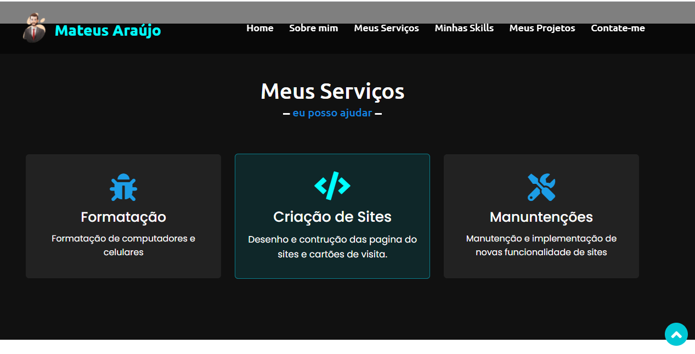
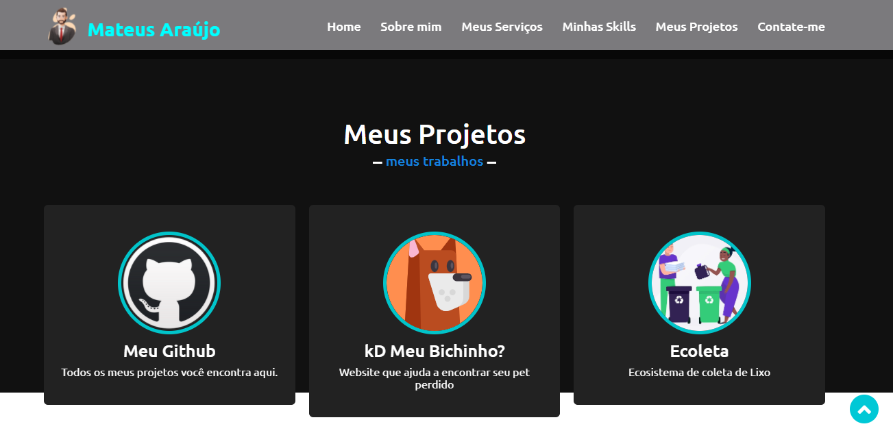

# portifolio
Meu portfólio criado com o objetivo de mostrar meus projetos e currículo .

## 🖼 Screenshot das telas da aplicação 
## 🖼 Tela sobre mim

  

## 🖼 Tela dos meus seviços que ofereço 

  

## 🖼 Tela dos meus projetos

  

## 🖼 Tela para os meus contatos

 
  
## 🛠 Tecnologias

As seguintes ferramentas foram usadas na construção do projeto:

#### **Front-end** 
 

  

  
  
  

 

                 
                <b>Samara Regina</b>
            </a>
        </td>    
    </tr>
</table>
<h4 align="center">
   Feito com 💜 by  <a href="" target="_blank"> Samara </a>
</h4>
